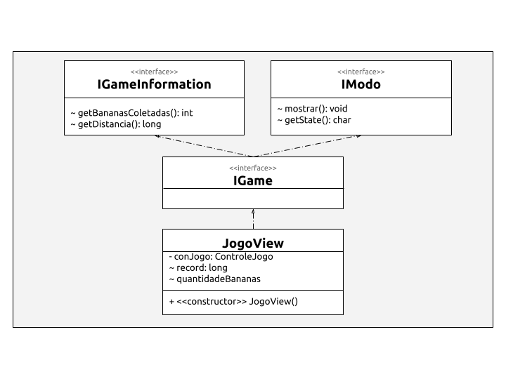
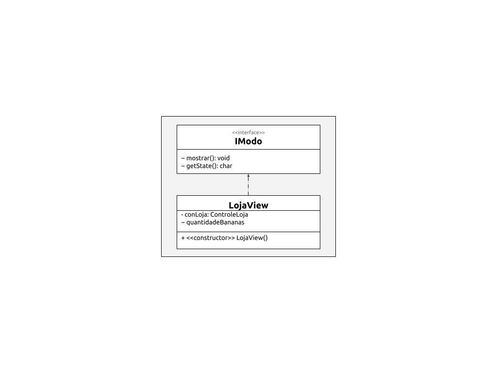

# Projeto Macaconautas

# Descrição Resumida do Projeto/Jogo

Em _Macaconautas_ o jogador controla um macaco com uma mochila a jato que deve desviar de aliens, lasers e obstáculos para coletar bananas e percorrer a maior distância possível. Ele pode comprar skins diferentes para o macaco com as bananas em nossa magnífica loja e tentar quebrar seus recordes de distância, com o jogo cada vez mais difícil com o aumento da distância!  
<b>OBS:</b> whey protein de banana pode ser um ótimo suplemento para um primata!

# Equipe

* `André Ricardo Pereira Silva` - `231391`
* `Pedro Henrique Pinheiro Gadêlha` - `186985`

# Vídeos do Projeto

## Vídeo da Prévia

[Link para o vídeo.](https://drive.google.com/file/d/1qr5MKYpSwSPLfJ39C_fErArR71p2KT8u/view?usp=sharing)

# Slides do Projeto

## Slides da Prévia

[Link para os slides.](https://drive.google.com/file/d/1KMDmPCyxy-PK8IQgqy-QHjUKPX5Bcj9d/view?usp=sharing)

# Documentação dos Componentes

# Diagramas

## Diagrama Geral do Projeto

> O AppMacaconautas inicializa o Controle. Então oControle inicializa algum dos três componentes: Jogo, Loja ou Menu, de acordo com o estado atual.

## Diagrama Geral de Componentes

### Componente Jogo

### Componente Menu

### Componente Loja

## Componente Jogo

> O Jogo é responsável pela administração, visualização e criação de elementos e do ambiente de jogo. Foi utilizado o pattern Model-View-Control para a sua arquitetura interna.

**Ficha Técnica**
item | detalhamento
----- | -----
Classe |  mc322.macaconautas.Jogo.* 
Autores | André Ricardo e Pedro Gadêlha
Interfaces | IGame

### Interfaces

Interfaces associadas a esse componente:

Interface agregadora do componente em Java:

~~~java
public interface IGame extends IGameInformation, IModo{}
~~~

## Componente Menu

> O Menu é responsável pela administração e visualização do ambiente de navegação entre o jogo e a loja, e para sair programa. Foi utilizado o pattern Model-View-Control para a sua arquitetura interna.

**Ficha Técnica**
item | detalhamento
----- | -----
Classe |  mc322.macaconautas.Menu.* 
Autores | André Ricardo e Pedro Gadêlha
Interfaces | IModo

### Interfaces

Interfaces associadas a esse componente:

Interface agregadora do componente em Java:

~~~java
public interface IModo {
  void mostrar();
  char getState();
}
~~~

## Componente Loja

> O Loja é responsável pela administração, visualização e criação de elementos e do ambiente de jogo. Foi utilizado o pattern Model-View-Control para a sua arquitetura interna.

**Ficha Técnica**
item | detalhamento
----- | -----
Classe |  mc322.macaconautas.Loja.* 
Autores | André Ricardo e Pedro Gadêlha
Interfaces | IModo

### Interfaces

Interfaces associadas a esse componente:

Interface agregadora do componente em Java:

~~~java
public interface IModo {
  void mostrar();
  char getState();
}
~~~

## Detalhamento das Interfaces

### Interface IModo

Responsável pela visualização do jogo e por devolver o estado do jogo para alterar o estado do App.

~~~java
public interface IModo {
  void mostrar();
  char getState();
}
~~~

Método | Objetivo
-------| --------
void mostrar() | mostra na tela o serviço que o componente que o implementa oferece (o jogo, o menu ou a loja).
char getState() | devolve o estado atual do do Componente para realizar as devidas ações no app.

### Interface IGameInformation

Responsável por devolver ao app informações sobre resultados do jogo.

~~~java
public interface IGameInformation {
  int getBananasColetadas();
  long getDistancia();
}
~~~

Método | Objetivo
-------| --------
int getBananasColetadas() | devolve o número de bananas coletadas para setar o total de bananas que o jogador possui.
long getDistancia() | devolve a distância percorrida do jogador para setar, se for o novo recorde, a distância do app.

### Interface IGame

Interface agregadora que une IModo e IGameInformation para interagir com o componente Jogo.

~~~java
public interface IGame extends IGameInformation, IModo {
 
}
~~~

### Interface IInit

Inicia o App.
	
~~~java
public interface IInit {
  void init() throws InterruptionExcepion;
}
~~~

Método | Objetivo
-------| --------
void init() | reponsável por inicial o app.

# Plano de Exceções

## Diagrama da hierarquia de exceções
Terá o de salvamento e carregamento.

## Descrição das classes de exceção

Não possuímos um plano de exceção atual, pois o nosso jogo restringe ao máximo as ações do usuário. Contudo, estamos planejando o salvamento do jogo em um arquivo criptografado e iremos elaborar um plano de exceção para o carregamento do jogo salvo.

Classe | Descrição
----- | -----
FileNotFound | Arquivo de carregamento de jogo salvo não foi encontrado.
FileNotVerified | Arquivo não está no formato certo requerido pelo jogo.