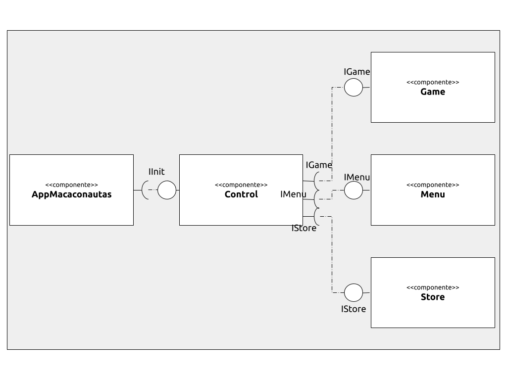
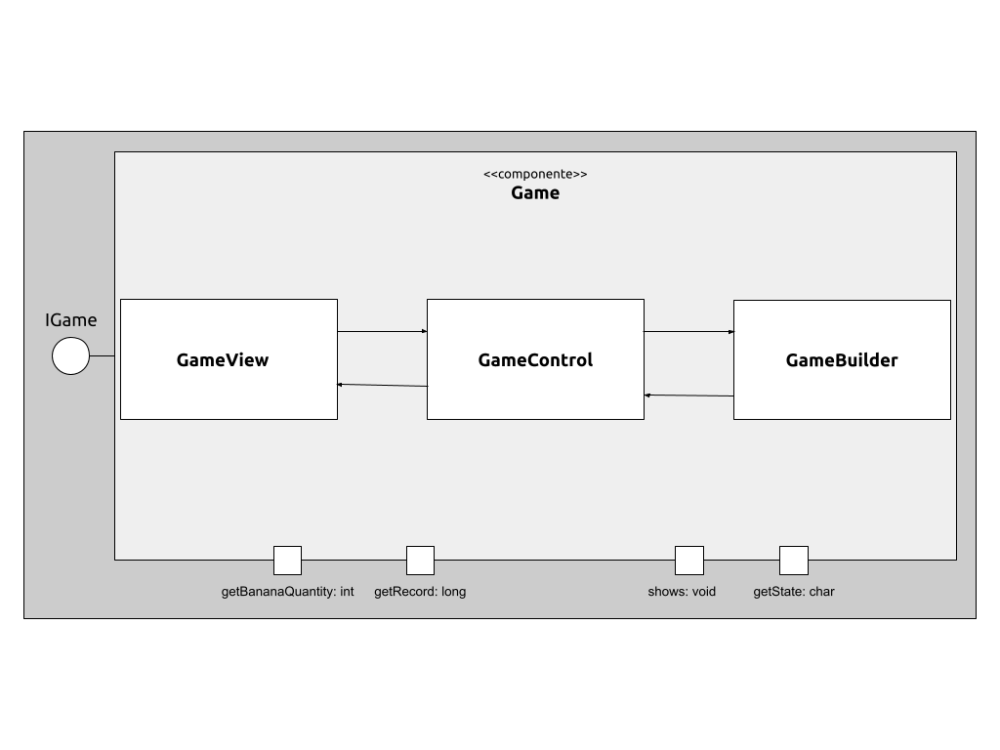
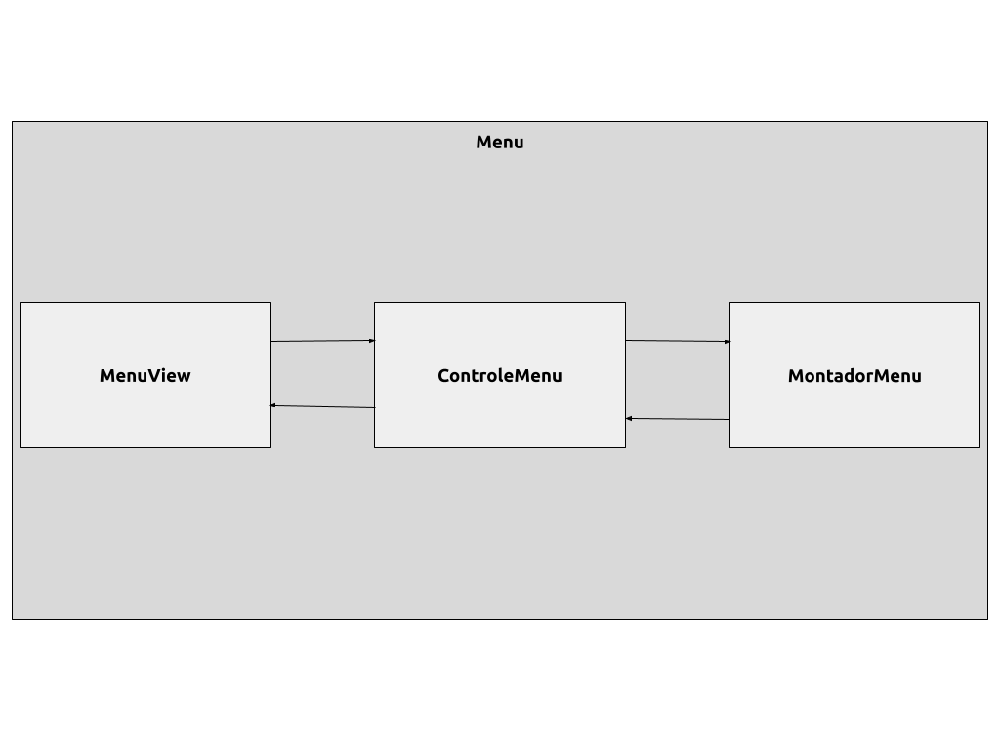
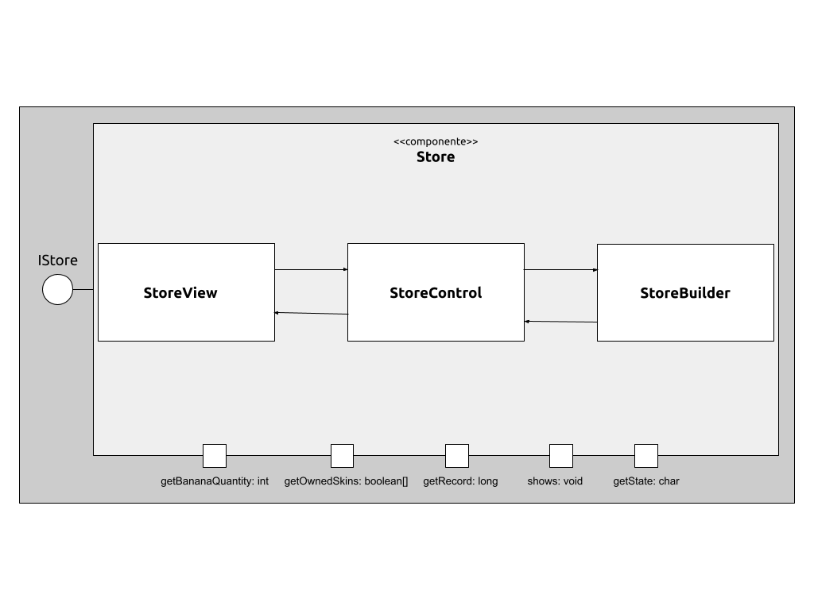
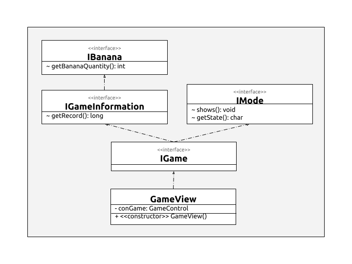
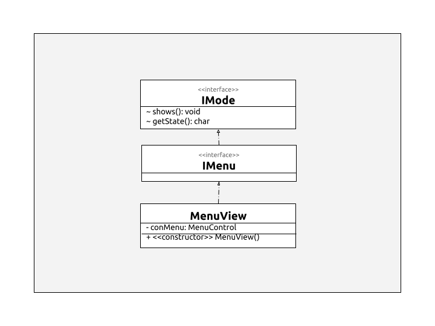
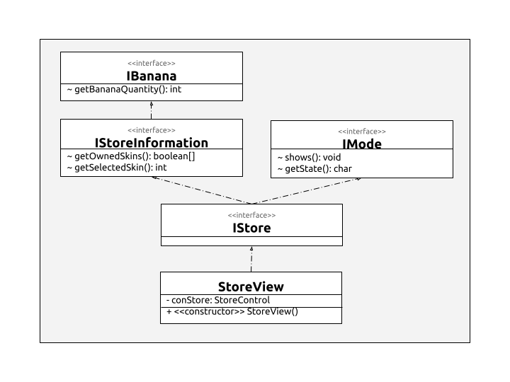

# Projeto Macaconautas

# Descrição Resumida do Projeto/Jogo

 Em _Macaconautas_ o jogador controla um macaco com uma mochila a jato que deve desviar de aliens, lasers e obstáculos para coletar bananas e percorrer a maior distância possível. Ele pode comprar skins diferentes para o macaco com as bananas em nossa magnífica loja e tentar quebrar seus recordes de distância, com o jogo cada vez mais difícil com o aumento da distância!  
<b>OBS:</b> whey protein de banana pode ser um ótimo suplemento para um primata!

# Equipe
* `André Ricardo Pereira Silva` - `231391`
* `Pedro Henrique Pinheiro Gadêlha` - `186985`

# Vídeos do Projeto

## Vídeo da Prévia

 [Link para o vídeo.](https://drive.google.com/file/d/1qr5MKYpSwSPLfJ39C_fErArR71p2KT8u/view?usp=sharing)

## Vídeo do Jogo
> <Coloque um link para o vídeo em que é demonstrada a versão final do jogo. Esse vídeo deve ter em torno de 5 minutos. Este vídeo não apresenta slides, nem substitui a apresentação final do projeto, que será feita por conferência. Ele mostra apenas o jogo em funcionamento.>

# Slides do Projeto

## Slides da Prévia
[Link para os slides.](https://drive.google.com/file/d/1KMDmPCyxy-PK8IQgqy-QHjUKPX5Bcj9d/view?usp=sharing)

## Slides da Apresentação Final
`<Coloque um link para os slides da apresentação final do projeto.>`

## Relatório de Evolução

**Evolução:** Inicialmente desenvolvemos o código sem ligar muito para a arquitetura e organização, apenas tentando fazer o jogo rodar. Contudo, conseguimos nos estruturar de forma eficaz para montar uma estrutura de “dupla camada” do pattern MVC (Model-View-Controller), tornando o código mais limpo, legível e de fácil extensão. Ao longo do jogo, desenvolvemos novas ideias, como o Whey Protein de Banana para o macaco ficar quase imortal; novas ideias de skins para o herói utilizar; spawner de entidades baseado em um modelo probabilístico, para nunca gerar de uma forma que fique impossível para o macaco e muitas melhorias na arquitetura baseado nos modelos aprendidos em POO.  
**Lições:** Aprendemos que estruturar o jogo antes de começar a programar é extremamente importante e poderia ter nos poupado muito mais tempo, pois ficamos “consertando” o código para obedecer corretamente as regras básicas de POO (encapsulamento, polimorfismo, heranças, etc). Aprendemos também que é muito importante a ferramenta de pesquisa individual, pesquisando vários assuntos e estudando e buscando informações encontramos várias técnicas e sugestões que nos ajudaram a desenvolver o nosso código de forma eficiente e totalmente profissional!

# Destaques de Código

> <Escolha trechos relevantes e/ou de destaque do seu código. Apresente um recorte (você pode usar reticências para remover partes menos importantes). Veja como foi usado o highlight de Java para o código.>

~~~java
// Recorte do seu código
public void algoInteressante(…) {
   …
   trechoInteressante = 100;
}
~~~

# Destaques de Pattern
`<Destaque de patterns adotados pela equipe. Sugestão de estrutura:>`

## Diagrama do Pattern
`<Diagrama do pattern dentro do contexto da aplicação.>`

## Código do Pattern
~~~java
// Recorte do código do pattern seguindo as mesmas diretrizes de outros destaques
public void algoInteressante(…) {
   …
   trechoInteressante = 100;
}
~~~

> <Explicação de como o pattern foi adotado e quais suas vantagens, referenciando o diagrama.>

# Conclusões e Trabalhos Futuros

Neste trabalho, chegamos a conclusão de que é sempre importante montar a estrutura, principalmente de uma forma visual, para ter uma noção concreta da arquitetura do jogo antes de começar a “botar a mão na massa”.
Para projetos futuros tivemos incontáveis ideias:
* **Aumento da dificuldade do jogo:** cada vez que o herói passa por uma frota, o número de entidades inimigas aumentam e a velocidade delas também… (tendendo sempre a um valor máximo).
* **Melhorar codificação:** aumentar a dificuldade de codificação para evitar manipulação do usuário nos dados salvos.
* **Mudar derrota da frota:** disponibilizar armas para o macaco poder utilizar em sua batalha com a frota alien.
* **Mudar spawner de entidades:** evitar sobreposição de elementos no jogo e melhorar a lógica de surgimento deles.
* **Responsividade do jogo:** alterar para que o jogo seja responsivo, isto é, mantenha-se nas mesmas proporções para todo formato de telas (incluindo de celular).
* **Novos itens na loja:** novas coisas além de skins, como chapéus, calças, trocar apenas o jetpack, etc.
* **Melhorar design:** Melhorar o design no geral, como um jogo com gráficos melhores, uma melhor apresentação das informações (como informar quando se obteve um novo recorde, entre outros), além de deixar o jogo mais interativo (eventos com o mouse, digitar e salvar o nome de quem está jogando, etc).
* **Múltiplos saves e Novo Jogo:** permitir o usuário ter vários saves para escolher qual ele vai querer iniciar.

# Documentação dos Componentes

# Diagramas

## Diagrama Geral do Projeto

O AppMacaconautas inicializa o Control. Então o Control inicializa algum dos três componentes: Game, Store ou Menu, de acordo com o estado atual.

## Diagrama Geral de Componentes

### Componente Game

### Componente Menu

### Componente Store

## Componente Game

O Game é responsável pela administração, visualização e criação de elementos e do ambiente de jogo. Foi utilizado o pattern Model-View-Control para a sua arquitetura interna.

**Ficha Técnica**
item | detalhamento
----- | -----
Classe |  mc322.macaconautas.Game.* 
Autores | André Ricardo e Pedro Gadêlha
Interfaces | IGame

### Interfaces

Interfaces associadas a esse componente:

Interface agregadora do componente em Java:

~~~java
public interface IGame extends IGameInformation, IMode{

}
~~~

## Componente Menu

O Menu é responsável pela administração e visualização do ambiente de navegação entre game e store, e para sair do programa. Foi utilizado o pattern Model-View-Control para a sua arquitetura interna.

**Ficha Técnica**
item | detalhamento
----- | -----
Classe |  mc322.macaconautas.Menu.* 
Autores | André Ricardo e Pedro Gadêlha
Interfaces | IMenu

### Interfaces

Interfaces associadas a esse componente:

Interface agregadora do componente em Java:

~~~java
public interface IMenu extends IMode {

}
~~~

## Componente Store

A Store é responsável pela administração, visualização e criação de elementos e do ambiente de jogo. Foi utilizado o pattern Model-View-Control para a sua arquitetura interna.

**Ficha Técnica**
item | detalhamento
----- | -----
Classe |  mc322.macaconautas.Store.* 
Autores | André Ricardo e Pedro Gadêlha
Interfaces | IStore

### Interfaces

Interfaces associadas a esse componente:

Interface agregadora do componente em Java:

~~~java
public interface IStore extends IMode, IStoreInformation{

}
~~~

## Detalhamento das Interfaces

### Interface IMode

Responsável pela visualização do jogo e por devolver o estado do jogo para alterar o estado do App.

~~~java
public interface IMode {
  void shows() throws InterruptedException;
  char getState();
}
~~~

Método | Objetivo
-------| --------
void shows() throws InterruptedException | mostra na tela o serviço que o componente que o implementa oferece (o game, o menu ou a store).
char getState() | devolve o estado atual do do Componente para realizar as devidas ações no app.

### Interface IBanana

Responsável por devolver a quantidade de bananas em posse.

~~~java
public interface IBanana {
	int getBananaQuantity();
}
~~~

Método | Objetivo
-------| --------
int getBananaQuantity() | devolve a quantidade de bananas após certas mudanças.

### Interface IGameInformation

Responsável por devolver ao controle informações sobre resultados do jogo.

~~~java
public interface IGameInformation extends IBanana{
long getRecord();
}
~~~

Método | Objetivo
-------| --------
long getRecord() | devolve a distância percorrida do jogador para setar, se for o novo recorde, a distância do app.

### Interface IGame

Interface agregadora que une IMode e IGameInformation para interagir com o componente Jogo.

~~~java
public interface IGame extends IGameInformation, IMode {
 
}
~~~

### Interface IMenu

Interface agregadora que usa IMode para interagir com o componente Menu.

~~~java
public interface IMenu extends IMode {
 
}
~~~

### Interface IStoreInformation

Responsável por devolver ao controle informações sobre a store.

~~~java
public interface IStoreInformation extends IBanana {
	boolean[] getOwnedSkins();
	int getSelectedSkin();
}
~~~

Método | Objetivo
-------| --------
boolean[] getOwnedSkins() | devolve todas as skins que o usuário possui.
int getSelectedSkin() | devolve a skin que o usuário selecionou por último.

### Interface IStore

Interface agregadora que une IMode e IStoreInformation para interagir com o componente Store.

~~~java
public interface IStore extends IStoreInformation, IMode {
 
}
~~~

### Interface ISaveGameHandling

Responsável por fazer a conexão do SaveGameHandling com o Control para salvar e carregar os dados do jogo.

~~~java
public interface ISaveGameHandling {
	public String[] getSavedInfo();
	public void saveGame(boolean[] ownedSkins, int selectedSkin, int bananaQuantity, long record);
}
~~~

Método | Objetivo
-------| --------
public String[] getSavedInfo() | retorna as informações do jogo salvo no arquivo save.txt.
public void saveGame(boolean[] ownedSkins, int selectedSkin, int bananaQuantity, long record) | realizar o salvamento no jogo com base nos dados recebidos no atributo.

### Interface IInit

Inicia o App.
	
~~~java
public interface IInit {
  void init() throws InterruptionExcepion;
}
~~~

Método | Objetivo
-------| --------
void init() | responsável por iniciar o app.

# Plano de Exceções

## Diagrama da hierarquia de exceções
Descritas abaixo.

## Descrição das classes de exceção

Não vimos a necessidade de utilizar classes muito estruturadas para plano de exceção, pois as ações do jogo são bem restritas para o usuário. Portanto, utilizamos de classes que já estão nas bibliotecas disponíveis pelo Java.

Classe | Descrição
----- | -----
InterruptedException | Ocorre quando a thread é interrompida por algum motivo.
FileNotFoundException | ocorre quando um arquivo requerido não existe.
IOException | pega todos os casos gerais de erros desconhecidos.

