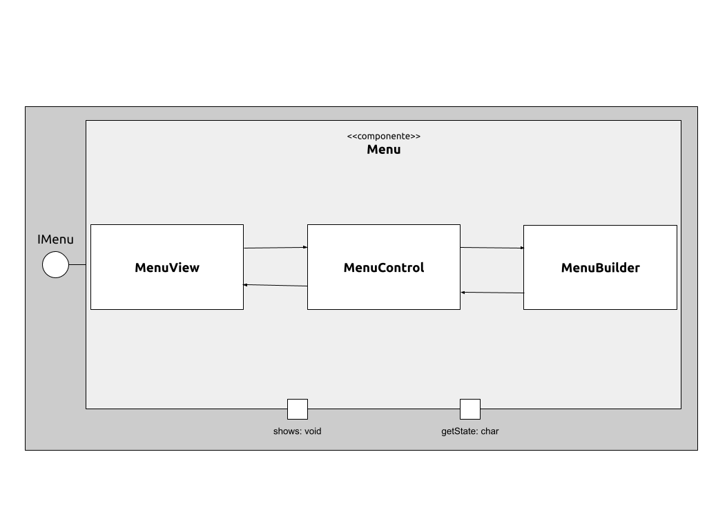

# Projeto Macaconautas

# Descrição Resumida do Projeto/Jogo

Em _Macaconautas_ o jogador controla um macaco com uma mochila a jato que deve desviar de aliens, lasers e obstáculos para coletar bananas e percorrer a maior distância possível.

# Equipe

* `André Ricardo Pereira Silva` - `231391`
* `Pedro Henrique Pinheiro Gadêlha` - `186985`

# Vídeos do Projeto

## Vídeo da Prévia

[Link para o vídeo.](https://drive.google.com/file/d/1qr5MKYpSwSPLfJ39C_fErArR71p2KT8u/view?usp=sharing)

# Slides do Projeto

## Slides da Prévia

[Link para os slides.](https://drive.google.com/file/d/1KMDmPCyxy-PK8IQgqy-QHjUKPX5Bcj9d/view?usp=sharing)

# Documentação dos Componentes

# Diagramas

## Diagrama Geral do Projeto

> O AppMacaconautas inicializa o Controle. Então o Controle inicializa o algum dos três componentes: Jogo, Loja ou Menu, de acordo com o estado atual.

## Diagrama Geral de Componentes

### Componente Jogo

### Componente Menu

### Componente Loja

## Componente Jogo

> <Resumo do papel do componente e serviços que ele oferece.>

**Ficha Técnica**
item | detalhamento
----- | -----
Classe |  src.src.mc233.macaconautas.Jogo.* 
Autores | André Ricardo e Pedro Gadelha
Interfaces | IGame

### Interfaces

Interfaces associadas a esse componente:

Interface agregadora do componente em Java:

~~~java
public interface IDataSet extends ITableProducer, IDataSetProperties {
}
~~~

## Componente Menu

> <Resumo do papel do componente e serviços que ele oferece.>

**Ficha Técnica**
item | detalhamento
----- | -----
Classe |  src.src.mc233.macaconautas.Mneu.* 
Autores | André Ricardo e Pedro Gadelha
Interfaces | IModo

### Interfaces

Interfaces associadas a esse componente:

Interface agregadora do componente em Java:

~~~java
public interface IDataSet extends ITableProducer, IDataSetProperties {
}
~~~

## Componente Loja

> <Resumo do papel do componente e serviços que ele oferece.>

**Ficha Técnica**
item | detalhamento
----- | -----
Classe |  src.src.mc233.macaconautas.Loja.* 
Autores | André Ricardo e Pedro Gadelha
Interfaces | IModo

### Interfaces

Interfaces associadas a esse componente:

Interface agregadora do componente em Java:

~~~java
public interface IDataSet extends ITableProducer, IDataSetProperties {
}
~~~

## Detalhamento das Interfaces

### Interface `<nome da interface>`

`<Resumo do papel da interface.>`

~~~
<Interface em Java.>
~~~

Método | Objetivo
-------| --------
`<id do método em Java>` | `<objetivo do método e descrição dos parâmetros>`

## Exemplo:

### Interface `ITableProducer`

Interface provida por qualquer fonte de dados que os forneça na forma de uma tabela.

~~~java
public interface ITableProducer {
  String[] requestAttributes();
  String[][] requestInstances();
}
~~~

Método | Objetivo
-------| --------
`requestAttributes` | Retorna um vetor com o nome de todos os atributos (colunas) da tabela.
`requestInstances` | Retorna uma matriz em que cada linha representa uma instância e cada coluna o valor do respectivo atributo (a ordem dos atributos é a mesma daquela fornecida por `requestAttributes`.

### Interface `IDataSetProperties`

Define o recurso (usualmente o caminho para um arquivo em disco) que é a fonte de dados.

~~~java
public interface IDataSetProperties {
  public String getDataSource();
  public void setDataSource(String dataSource);
}
~~~

Método | Objetivo
-------| --------
`getDataSource` | Retorna o caminho da fonte de dados.
`setDataSource` | Define o caminho da fonte de dados, informado através do parâmetro `dataSource`.

# Plano de Exceções

## Diagrama da hierarquia de exceções
`<Elabore um diagrama com a hierarquia de exceções como detalhado abaixo>`

## Descrição das classes de exceção

`<Monte uma tabela descritiva seguindo o exemplo>:`

Classe | Descrição
----- | -----
DivisaoInvalida | Engloba todas as exceções de divisões não aceitas.
DivisaoInutil | Indica que a divisão por 1 é inútil.
DivisaoNaoInteira | Indica uma divisão não inteira.
